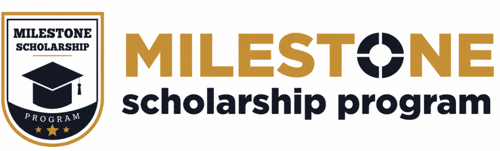

# Milestone Scholarship Program

Milestone Scholarship Program is a premium, modern EdTech web application designed to empower students across India by providing equal access to quality education, guidance, mentorship, and financial opportunities.

Built with performance, accessibility, and a world-class user experience in mind, this platform connects deserving students with the resources they need to achieve their academic dreams.



## ✨ Key Features

- **Premium UI/UX:** A highly polished, responsive interface featuring glassmorphism, subtle gradients, and smooth animations using Tailwind CSS and Framer Motion.
- **Secure Authentication:** Complete integration with [Clerk](https://clerk.com/) for secure sign-in, sign-up, and session management.
- **Dark & Light Mode:** Seamless theming support with beautiful, high-contrast layouts for both light and dark environments.
- **Student Dashboard:** Protected routes ensuring sensitive student data and application status are only accessible to authenticated users.
- **Modern Contact & Support:** A custom-built, trustworthy support interface ensuring students have 24/7 access to help.

## 🛠 Tech Stack

- **Framework:** [Next.js 16](https://nextjs.org/) (App Router, Turbopack)
- **Language:** TypeScript
- **Styling:** [Tailwind CSS](https://tailwindcss.com/)
- **UI Components:** [Radix UI](https://www.radix-ui.com/) + Custom implementations
- **Animations:** [Framer Motion](https://www.framer.com/motion/)
- **Icons:** [Lucide React](https://lucide.dev/)
- **Authentication:** [Clerk](https://clerk.com/)

## 🚀 Getting Started

Follow these instructions to get a local copy of the project up and running.

### Prerequisites

- Node.js 18.x or higher
- npm, yarn, pnpm, or bun

### Installation

1. **Clone the repository**
   ```bash
   git clone https://github.com/your-username/milestone-scholarship.git
   cd milestone-scholarship
   ```

2. **Install dependencies**
   ```bash
   npm install
   ```

3. **Set up environment variables**
   Create a `.env.local` file in the root directory and add your Clerk API keys:
   ```env
   NEXT_PUBLIC_CLERK_PUBLISHABLE_KEY=pk_test_...
   CLERK_SECRET_KEY=sk_test_...

   NEXT_PUBLIC_CLERK_SIGN_IN_URL=/sign-in
   NEXT_PUBLIC_CLERK_SIGN_UP_URL=/sign-up
   NEXT_PUBLIC_CLERK_AFTER_SIGN_IN_URL=/dashboard
   NEXT_PUBLIC_CLERK_AFTER_SIGN_UP_URL=/dashboard
   
   # NEXT_PUBLIC_APP_URL=http://localhost:3000
   ```

4. **Run the development server**
   ```bash
   npm run dev
   ```

5. **Open the application**
   Open [http://localhost:3000](http://localhost:3000) in your browser.

## 📂 Project Structure

```text
src/
├── app/                  # Next.js App Router pages (Home, About, Contact, Auth, etc.)
├── components/           # Reusable UI components
│   ├── layout/           # Navbar, Footer, etc.
│   ├── providers/        # Theme & Authentication providers
│   └── ui/               # Base UI elements (Buttons, Inputs, Cards)
├── constants/            # Application data and constants (Navigation links)
├── lib/                  # Utility functions (cn for Tailwind merging)
└── middleware.ts         # Clerk Authentication middleware
```

## 🌍 Deployment

The easiest way to deploy this Next.js app is to use [Vercel](https://vercel.com/).

1. Push your code to a GitHub repository.
2. Import the project into Vercel.
3. Add your `NEXT_PUBLIC_CLERK_PUBLISHABLE_KEY` and `CLERK_SECRET_KEY` (using your live production keys) in the Vercel Environment Variables settings.
4. Deploy!

For detailed deployment instructions, check out the [Next.js deployment documentation](https://nextjs.org/docs/app/building-your-application/deploying).

## 📄 License

This project is proprietary and intended solely for the Milestone Scholarship Program.
